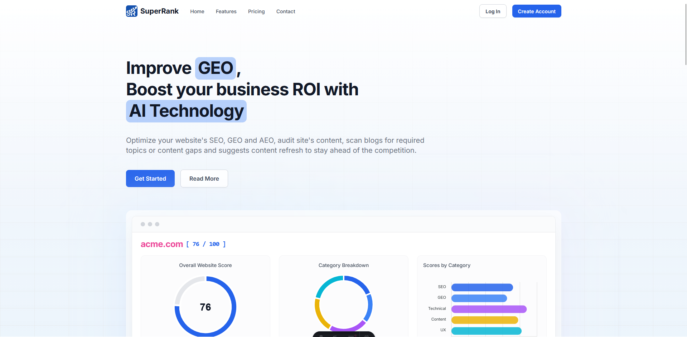
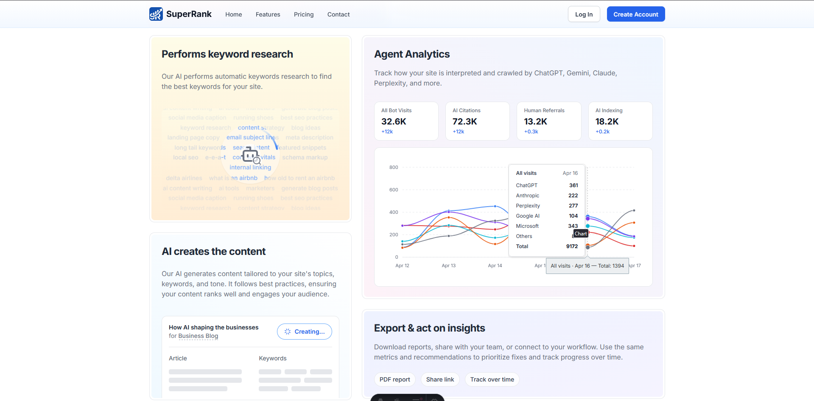
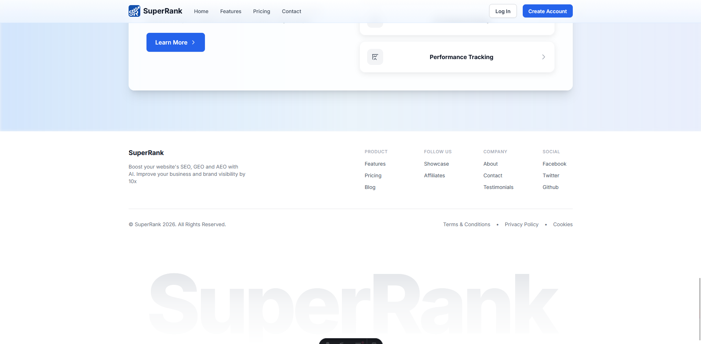

# SuperRank - Customer facing marketing site
An AI-powered platform that helps businesses improve **GEO** (Generative Engine Optimization) alongside SEO and AEO. Customers learn how the product audits site content, surfaces gaps, and suggests refreshes so teams can stay competitive.


This is the customer facing page created using [Astro Web Framework](https://astro.build).

<br />
<br />



<br />
<br />

## Below are the required repos associated with this project:
#### Frontend: [superrank-frontend](https://github.com/autocontent-in/superrank-frontend)
#### Backend: [superrank-backend](https://github.com/autocontent-in/superrank-backend)
#### AI backend - [superrank-ai-fastapi](https://github.com/autocontent-in/superrank-ai-fastapi)

<br />

> **Note:** <br /> The above 3 mentioned repos are required to run  at the same time for the project to run

<br />
<br />

## Project Setup
#### 1. Clone the repo
```
git clone git@github.com:autocontent-in/superrank-astro-marketing.git
```

#### 2. Navigate to the repo directory
```
cd superrank-astro-marketing
```

#### 3. Copy `.env.example` and rename it to `.env`

#### 4. Install packages
```
npm install
```

#### 5. Run the project
```
npm run dev
```

#### Open `http://localhost:4321` in your browser

### That's it!

## Some of the project screenshots




## Thank you.
